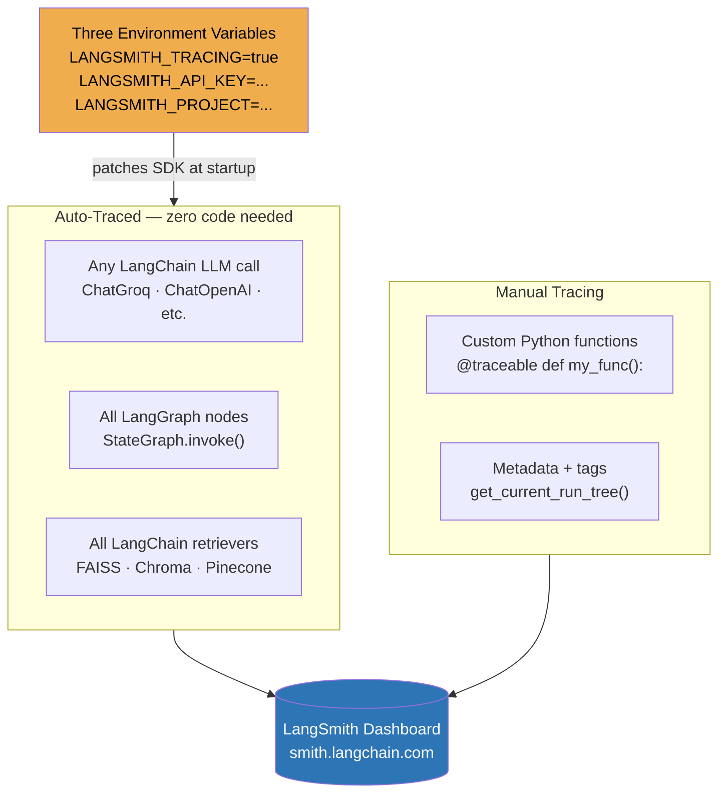
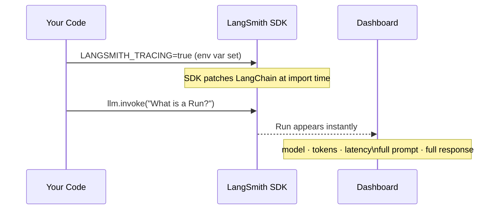
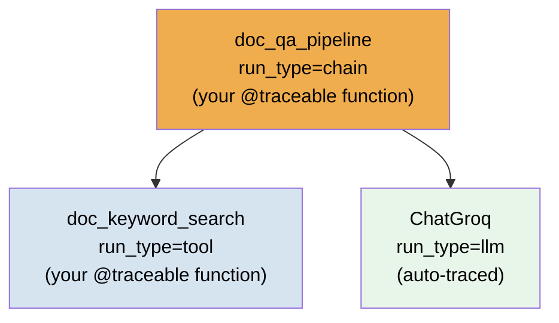
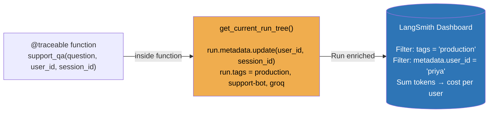
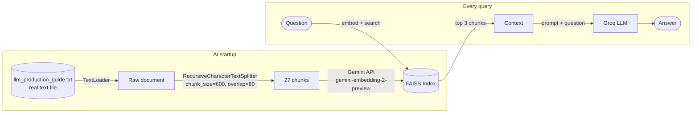
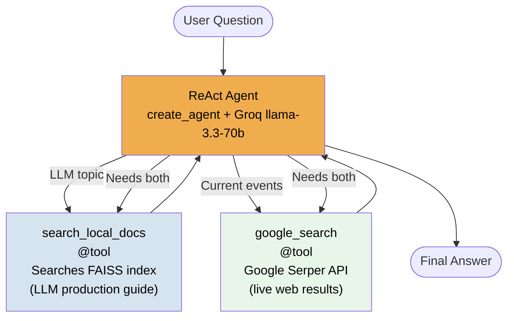
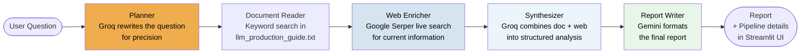
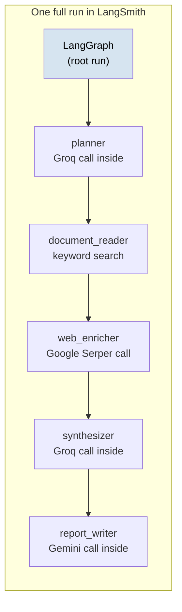

# LangSmith — LLM Tracing & Observability

**Module 4 · Instructor: Divesh · Production-Grade LLM Engineering**

---

## What This Module Covers

| File | Purpose |
|------|---------|
| `langsmith_basics.ipynb` | 5 experiments — auto-tracing, @traceable, RAG, multi-tool agent |
| `app.py` | Streamlit chat app — 5-node sequential document intelligence agent |
| `agent/` | Modular LangGraph agent (state · tools · nodes · graph) |
| `data/llm_production_guide.txt` | Local knowledge base — LLM security & deployment guide |

---

## What is LangSmith?

LangSmith is an **LLM observability platform** built by LangChain. Set three environment variables and every LangChain/LangGraph call is automatically logged — model name, tokens, latency, full prompt, full response.

```
Without LangSmith:   llm.invoke("What is RAG?")  →  answer only, nothing logged

With LangSmith:      llm.invoke("What is RAG?")  →  answer PLUS:
                       model = llama-3.3-70b-versatile
                       input_tokens = 8, output_tokens = 142
                       latency = 412ms
                       full prompt text
                       full response text
                       cost = $0.00002
```

### Why LangSmith Is Useful

| Problem in production | How LangSmith solves it |
|-----------------------|------------------------|
| "Why did the LLM give a bad answer?" | See the **exact prompt** that was sent, including all retrieved context |
| "Which users are costing the most tokens?" | Filter by `metadata.user_id` and sum tokens across traces |
| "Is the agent looping or calling the wrong tool?" | Every tool call and LLM reasoning step is a visible child Run |
| "How fast are my LLM calls?" | Latency recorded per Run — spot slow retrievers or models immediately |
| "What changed between yesterday and today?" | Compare runs across time in the dashboard with tags and metadata |

### The Three Env Vars That Activate Everything

```bash
LANGSMITH_TRACING=true          # master switch — turns tracing on
LANGSMITH_API_KEY=ls__...       # your API key from smith.langchain.com
LANGSMITH_PROJECT=my-project    # groups your traces under a project name
```

That's it. No `configure()` call, no `instrument_openai()`, no spans. Just env vars.

---

## LangSmith vs Logfire — Key Differences

| Dimension | LangSmith | Pydantic Logfire |
|-----------|-----------|-----------------|
| **Tracing setup** | 3 env vars — zero code | `logfire.configure()` + `instrument_openai()` |
| **Custom functions** | `@traceable` decorator | `with logfire.span():` context manager |
| **Framework** | LangChain/LangGraph ecosystem | Framework-agnostic |
| **Protocol** | Proprietary (LangSmith) | OpenTelemetry (portable) |
| **Dashboard** | smith.langchain.com | logfire.pydantic.dev |
| **Auto-traces** | All LangChain objects + LangGraph | Only patched SDKs (openai, httpx, etc.) |

---

## How LangSmith Tracing Works



---

## Core Terminology

### Run
A **Run** is LangSmith's unit of tracing — one recorded execution of any component. Every `llm.invoke()`, every retriever call, every LangGraph node creates a Run automatically.

```
Run types:
  llm       → a language model call
  chain     → an orchestrator / graph run
  retriever → a vector store search
  tool      → a function/tool call by an agent
```

### Trace
A **Trace** is a tree of Runs for one logical operation. When a chain calls a retriever and an LLM, the chain is the parent Run; retriever and LLM are child Runs.

```
Trace: production_guide_rag  (run_type=chain)
  └── ChatGroq                (run_type=llm)
        full prompt + response, tokens, cost visible here
```

### Project
A **Project** groups related traces. Set via `LANGSMITH_PROJECT=my-project`. Use separate projects for dev, staging, and production.

### @traceable
The `@traceable` decorator makes any custom Python function appear in the trace tree, just like a LangChain object. It intercepts the function call, wraps it in a Run, and sends it to LangSmith.

```python
from langsmith import traceable

@traceable(run_type="tool", name="doc_keyword_search")
def search_document(query: str) -> list:
    # now visible as a child Run in LangSmith
    ...

@traceable(run_type="chain", name="doc_qa_pipeline")
def doc_qa(question: str) -> str:
    # parent Run — search_document and llm.invoke() nest inside this
    sections = search_document(question)   # child Tool Run
    return llm.invoke(prompt).content     # child LLM Run
```

**`run_type` values:**

| Value | When to use |
|-------|------------|
| `"llm"` | Function that calls a language model |
| `"tool"` | Function that retrieves data, searches, or calls an API |
| `"chain"` | Orchestrator function that calls other functions |

### get_current_run_tree
`get_current_run_tree()` returns the currently active LangSmith Run object from inside a `@traceable` function. Use it to attach metadata and tags to the parent Run from within the function body — where the values are actually known.

```python
from langsmith import traceable, get_current_run_tree

@traceable(run_type="chain", name="support-query")
def support_qa(question: str, user_id: str, session_id: str) -> str:
    run = get_current_run_tree()
    if run:
        run.metadata.update({"user_id": user_id, "session_id": session_id})
        run.tags = ["production", "support-bot", "groq"]
    return llm.invoke(question).content
```

> **Important:** Do NOT pass `langsmith_extra` directly to `llm.invoke()`. That kwarg is only valid when calling `@traceable`-decorated functions at the call site. Inside a `@traceable` function, use `get_current_run_tree()` to attach metadata.

### Tags & Metadata
- **Tags** — string labels for filtering: `["production", "groq"]`
- **Metadata** — key-value dict for analytics: `{"user_id": "alice", "session": "s1"}`
- Set via `get_current_run_tree()` inside any `@traceable` function

### create_agent
`create_agent` (from `langchain.agents`) is the current standard agent entry point as of LangChain 1.0+. It builds a ReAct agent on top of the LangGraph runtime, replacing the older `AgentExecutor` and `langgraph.prebuilt.create_react_agent`.

```python
from langchain.agents import create_agent

agent = create_agent(
    model=llm,                          # any LangChain chat model
    tools=[search_local_docs, google_search],
    system_prompt="You are a research assistant..."
)

result = agent.invoke({"messages": [HumanMessage(content=question)]})
```

The agent loops: **Reason → Act (call tool) → Observe → Reason** until it produces a final answer or hits the recursion limit.

### recursion_limit
LangGraph's `recursion_limit` caps the number of node executions (supersteps) in one agent run. For a 2-tool ReAct agent the "both tools" path uses exactly 5 supersteps (LLM → tool1 → LLM → tool2 → LLM). Set to at least **10** to give room for the final answer step.

```python
result = agent.invoke(
    {"messages": [HumanMessage(content=question)]},
    config={"recursion_limit": 10}
)
```

---

## The Notebook — 5 Experiments

### Overview

| Part | Experiment | What You Learn |
|------|-----------|----------------|
| 1 | **Exp 1** — Auto-tracing | `llm.invoke()` traced with zero code via env vars |
| 1 | **Exp 2** — @traceable | Custom Python functions visible as nested child Runs |
| 1 | **Exp 3** — Enrichment | `get_current_run_tree()` to attach tags and metadata inside `@traceable` |
| 2 | **Exp 4** — Traced RAG | Real text file → chunked → Gemini embeddings → `@traceable` RAG |
| 2 | **Exp 5** — Multi-tool agent | 2 tools (FAISS + Serper), `create_agent`, auto-traced LangGraph |

---

### Experiment 1 — Auto-Tracing with Zero Code



```python
from langchain_groq import ChatGroq

llm = ChatGroq(model="llama-3.3-70b-versatile", temperature=0.3)

# Zero tracing code — env vars handle everything
response = llm.invoke("What is a LangSmith Run? Answer in 2 sentences.")
print(response.content)
```

Just set the env vars. Call `llm.invoke()`. Watch the run appear in the dashboard.
**No spans, no wrappers, no extra code.**

---

### Experiment 2 — @traceable: Your Functions in the Trace Tree



```python
from langsmith import traceable

@traceable(run_type="tool", name="doc_keyword_search")
def search_document(query: str, top_k: int = 3) -> list:
    # keyword search over llm_production_guide.txt
    ...

@traceable(run_type="chain", name="doc_qa_pipeline")
def doc_qa(question: str) -> str:
    sections = search_document(question)   # child Tool Run
    context  = "\n\n".join(sections)
    prompt   = f"Context:\n{context}\n\nQuestion: {question}\nAnswer concisely:"
    return llm.invoke(prompt).content     # child LLM Run
```

Without `@traceable`: LangSmith sees only the LLM call.
With `@traceable`: LangSmith sees your full function as a parent, with the LLM call nested inside.

---

### Experiment 3 — Tags, Metadata with get_current_run_tree



```python
from langsmith import traceable, get_current_run_tree

@traceable(run_type="chain", name="support-query")
def support_qa(question: str, user_id: str, session_id: str) -> str:
    run = get_current_run_tree()
    if run:
        run.metadata.update({
            "user_id":    user_id,
            "session_id": session_id,
            "feature":    "customer-support",
            "env":        "production",
        })
        run.tags = ["production", "support-bot", "groq"]
    return llm.invoke(question).content

# Each call creates a separately tagged trace
for user, session, q in [
    ("priya",   "sess_001", "What is prompt injection?"),
    ("aditi",   "sess_002", "What are best practices for LLM output validation?"),
    ("sheetal", "sess_003", "How do we monitor LLM costs in production?"),
]:
    answer = support_qa(q, user_id=user, session_id=session)
```

**Real production use:** filter `metadata.user_id = "priya"` to see all of one user's traces and sum their token costs.

---

### Experiment 4 — Traced RAG over a Real Document



```python
from langsmith import traceable, get_current_run_tree

@traceable(run_type="chain", name="production_guide_rag")
def rag(question: str, user_id: str = "anonymous") -> str:
    docs    = retriever.invoke(question)
    context = "\n\n".join(f"[chunk {i+1}] {d.page_content}" for i, d in enumerate(docs))
    prompt  = f"Answer based ONLY on the context below.\n\nContext:\n{context}\n\nQuestion: {question}\n\nAnswer concisely:"

    run = get_current_run_tree()
    if run:
        run.metadata.update({"user_id": user_id, "chunks_retrieved": len(docs)})

    return llm.invoke(prompt).content
```

**What LangSmith shows:**
```
production_guide_rag  (run_type=chain, @traceable)
  └── ChatGroq        (run_type=llm, auto-traced)
        input:  full prompt WITH retrieved chunks
        output: answer
        metadata: user_id, chunks_retrieved
```

---

### Experiment 5 — Multi-Tool ReAct Agent

**Two tools — the agent decides which to call:**



```python
from langchain.agents import create_agent
from langchain_core.tools import tool
from langchain_core.messages import HumanMessage, ToolMessage, AIMessage

@tool
def search_local_docs(query: str) -> str:
    """Search the internal LLM production guide. Use only once per question."""
    docs = vectorstore.similarity_search(query, k=3)
    return "\n\n".join(f"[Chunk {i+1}]\n{doc.page_content[:700]}" for i, doc in enumerate(docs))[:2500]

@tool
def google_search(query: str) -> str:
    """Search the web for recent information. Use only once per question."""
    return str(serper.run(query))[:2500]

agent = create_agent(
    model=llm,
    tools=[search_local_docs, google_search],
    system_prompt="..."
)

def run_agent(question: str):
    result = agent.invoke(
        {"messages": [HumanMessage(content=question)]},
        config={"recursion_limit": 10}   # 10 = enough for 2-tool "both" path
    )
    tools_used = [m.name for m in result["messages"] if isinstance(m, ToolMessage)]
    final_answer = next((m.content for m in reversed(result["messages"]) if isinstance(m, AIMessage)), "")
    return final_answer, list(dict.fromkeys(tools_used))
```

**LangSmith auto-traces the full agent graph — zero extra code:**

```
langgraph run
  ├── ChatGroq  [decides: use search_local_docs]
  ├── search_local_docs  [tool call → FAISS results]
  ├── ChatGroq  [decides: also use google_search]
  ├── google_search  [tool call → live web results]
  └── ChatGroq  [generates final answer]
```

**Test queries — each triggers a different tool strategy:**

| Query | Expected tools |
|-------|---------------|
| `What are LLM prompt injection attacks?` | `search_local_docs` only |
| `What are the latest AI regulations in 2025?` | `google_search` only |
| `How does RAG work and what are the latest open-source RAG frameworks?` | Both tools |

---

## The Streamlit App — Document Intelligence Agent

A 5-node sequential research agent. Every query flows through all 5 nodes in order — each node adds information — producing a comprehensive report.

### Agent Pipeline



### The 5 Nodes — What Each Does

| Node | Model | What it does | Why it's a separate node |
|------|-------|-------------|--------------------------|
| **Planner** | Groq | Rewrites the user question for precision | Vague questions get bad retrieval; rewriting improves all downstream steps |
| **Document Reader** | — | Keyword search over `llm_production_guide.txt` | Separates local knowledge retrieval from web search |
| **Web Enricher** | Google Serper | Fetches live web results | Local guide has no current events; web fills the gap |
| **Synthesizer** | Groq | Merges doc sections + web results into analysis | Combining two sources needs its own reasoning step |
| **Report Writer** | Gemini | Formats into TL;DR + bullets + conclusion | Separates content generation from presentation formatting |

### LangSmith Trace for One App Run



**Zero tracing code in `agent/nodes.py`** — LangGraph + LangSmith env vars handle it all automatically.

```python
# LangSmith agent — nothing needed
def document_reader(state):
    sections = search_document(state["question"])
    return {"doc_sections": sections}
    # LangGraph traces this automatically via env vars

# Compare with Logfire — explicit spans required
def document_reader(state):
    with logfire.span("document_reader", question=state["question"]):  # manual
        sections = search_document(state["question"])
        return {"doc_sections": sections}
```

### Sample Queries

```
What are the biggest LLM security risks in production?
How does RAG reduce hallucinations and what are the best RAG frameworks?
Best practices for monitoring LLM costs at scale?
Latest developments in AI agent frameworks in 2025?
```

---

## File Structure

```
langsmith observability/
│
├── langsmith_basics.ipynb      ← 5 experiments (run top to bottom)
│
├── app.py                      ← Streamlit chat app
│
├── agent/
│   ├── state.py                ← AgentState TypedDict
│   ├── tools.py                ← search_document() keyword search utility
│   ├── nodes.py                ← 5 node functions (zero tracing code)
│   └── graph.py                ← Sequential StateGraph
│
├── data/
│   └── llm_production_guide.txt  ← knowledge base for RAG + agent
│
├── requirements.txt
└── .env
```

---

## Setup

### 1. Install

```bash
pip install -r requirements.txt
```

### 2. Get API keys

| Key | Where to get it |
|-----|----------------|
| `LANGSMITH_API_KEY` | smith.langchain.com → Settings → API Keys |
| `GROQ_API_KEY` | console.groq.com |
| `GEMINI_API_KEY` | aistudio.google.com |
| `SERPER_API_KEY` | serper.dev (free tier: 2,500 searches/month) |

### 3. Configure `.env`

```env
LANGSMITH_TRACING=true
LANGSMITH_API_KEY=ls__...
LANGSMITH_PROJECT=langsmith-observability-course

GROQ_API_KEY=gsk_...
GEMINI_API_KEY=...
SERPER_API_KEY=...
```

### 4. Run

```bash
# Notebook — open in Jupyter, run top to bottom
# Keep smith.langchain.com open in a browser tab

# Streamlit app
streamlit run app.py
```

---

## Key Concepts Quick Reference

| Term | One-line definition |
|------|-------------------|
| **Run** | One recorded execution of a component (LLM call, chain, tool, retriever) |
| **Trace** | A tree of Runs belonging to one logical end-to-end operation |
| **Project** | Namespace grouping related traces — set via `LANGSMITH_PROJECT` |
| **@traceable** | Decorator that makes any Python function visible as a Run in LangSmith |
| **run_type** | Category of a Run: `llm`, `chain`, `retriever`, `tool` |
| **get_current_run_tree()** | Returns the active Run object inside a `@traceable` function — use to set `.metadata` and `.tags` |
| **Tags** | String labels on a Run for dashboard filtering (`["production", "groq"]`) |
| **Metadata** | Key-value dict on a Run for analytics (`{"user_id": "alice"}`) |
| **run_name** | Custom title for a Run — overrides the auto-generated name |
| **create_agent** | LangChain 1.0+ standard agent builder on top of LangGraph runtime — replaces `AgentExecutor` |
| **recursion_limit** | Max LangGraph supersteps per agent run — set to 10+ for 2-tool agents |
| **StateGraph** | LangGraph class that defines a stateful multi-step workflow |
| **State** | TypedDict shared between all LangGraph nodes |
| **Node** | Python function that reads State and returns updated fields |
| **Edge** | Fixed connection between two nodes — always executed sequentially |
| **Chunk** | A piece of a document after text splitting for embedding |
| **FAISS** | In-memory vector similarity search — no server, runs locally |
| **Gemini Embeddings** | `gemini-embedding-2-preview` — API-based, reuses your `GEMINI_API_KEY` |
| **Google Serper** | Google Search API (serper.dev) — live web results, free tier available |
| **ReAct Agent** | LLM that loops: Reason → Act (call tool) → Observe → Reason again |